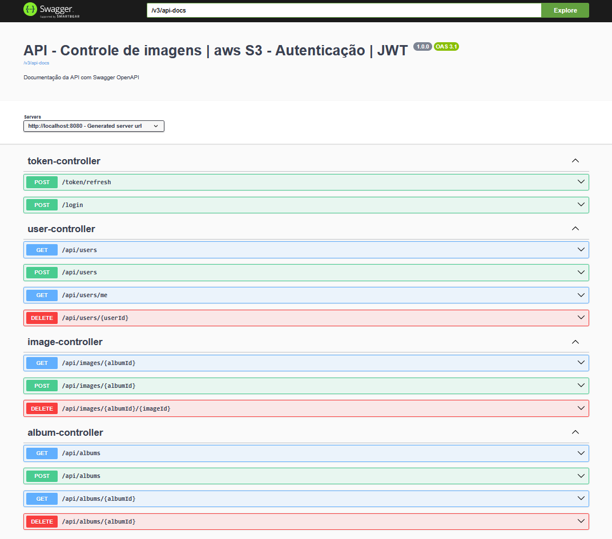

# Spring Security Album API

Uma API RESTful robusta desenvolvida em Spring Boot com Spring Security para gerenciamento de álbuns de fotos com autenticação JWT, controle de acesso baseado em roles e integração com AWS S3 para armazenamento de imagens.

## 🚀 Tecnologias Utilizadas

- **Java 21** - Linguagem de programação
- **Spring Boot 3.4.8** - Framework principal
- **Spring Security 6** - Framework de segurança
- **Spring Data JPA** - Persistência de dados
- **Hibernate 6** - ORM
- **PostgreSQL** - Banco de dados relacional
- **Flyway** - Migração de banco de dados
- **JWT (JSON Web Tokens)** - Autenticação stateless
- **AWS SDK S3 v2** - Armazenamento de imagens na nuvem
- **Lombok** - Redução de boilerplate
- **Maven** - Gerenciamento de dependências

## 📋 Pré-requisitos

- Java 21 ou superior
- Maven 3.6+
- PostgreSQL 12+
- Conta AWS com acesso ao S3
- Chaves RSA para assinatura de JWT

## 🏗️ Arquitetura do Projeto

### Estrutura de Módulos

```
src/main/java/tech/marcosmartinelli/springsecurity/
├── config/                           # Configurações da aplicação
│   ├── SecurityConfig.java           # Configuração de segurança e JWT
│   ├── AWSConfig.java                # Configuração AWS S3
│   ├── AdminUserConfig.java          # Configuração automática de usuário admin
│   └── WebConfig.java                # Configurações web
├── exception/                         # Tratamento de exceções
│   ├── GlobalExceptionHandler.java   # Handler global de exceções
│   └── ResourceNotFoundException.java # Exceção para recursos não encontrados
├── modules/
│   ├── auth/                         # Módulo de autenticação
│   │   ├── TokenController.java      # Controle de login e refresh token
│   │   └── dtos/                     # Data Transfer Objects
│   │       ├── LoginRequestDTO.java  # DTO para requisição de login
│   │       ├── LoginResponseDTO.java # DTO para resposta de login
│   │       └── RefreshTokenRequestDTO.java # DTO para refresh token
│   ├── users/                        # Módulo de usuários
│   │   ├── User.java                 # Entidade usuário
│   │   ├── UserController.java       # Controle de usuários
│   │   ├── UserService.java          # Lógica de negócio
│   │   ├── UserRepository.java       # Repositório de dados
│   │   └── dtos/                     # DTOs de usuário
│   │       ├── UserRequestDTO.java   # DTO para criação de usuário
│   │       ├── UserResponseDTO.java  # DTO para resposta de usuário
│   │       └── UserProfileDTO.java   # DTO para perfil do usuário
│   ├── album/                        # Módulo de álbuns
│   │   ├── Album.java                # Entidade álbum
│   │   ├── AlbumController.java      # Controle de álbuns
│   │   ├── AlbumService.java         # Lógica de negócio
│   │   ├── AlbumRepository.java      # Repositório de dados
│   │   ├── AlbumSecurityService.java # Serviço de segurança
│   │   └── dtos/                     # DTOs de álbum
│   │       ├── AlbumRequestDTO.java  # DTO para criação de álbum
│   │       ├── AlbumResponseDTO.java # DTO para resposta de álbum
│   │       └── AlbumWithCoverDTO.java # DTO com imagem de capa
│   ├── image/                        # Módulo de imagens
│   │   ├── Image.java                # Entidade imagem
│   │   ├── ImageController.java      # Controle de imagens
│   │   ├── ImageService.java         # Lógica de negócio
│   │   ├── ImageRepository.java      # Repositório de dados
│   │   └── dtos/                     # DTOs de imagem
│   │       └── ImagesByAlbumResponseDTO.java # DTO para imagens por álbum
│   └── role/                         # Módulo de roles
│       ├── Role.java                 # Entidade role
│       ├── RoleRepository.java       # Repositório de dados
│       └── enums/                    # Enumerações
│           └── RolesEnum.java        # Enum de roles disponíveis
```

## 🔐 Sistema de Autenticação e Segurança

### JWT (JSON Web Token)

- **Algoritmo**: RSA256 (chaves assimétricas)
- **Access Token**: 300 segundos (5 minutos)
- **Refresh Token**: 604800 segundos (7 dias)
- **Claims**: issuer, subject, scope, issuedAt, expiresAt, token_type

### Endpoints Públicos (Sem Autenticação)

- `POST /login` - Autenticação de usuário
- `POST /users` - Criação de novo usuário
- `POST /token/refresh` - Renovação de token

### Endpoints Protegidos (Com Autenticação)

- `GET /api/users/me` - Perfil do usuário atual
- `GET /api/users` - Listar todos os usuários (requer ADMIN)
- `DELETE /api/users/{userId}` - Deletar usuário (requer ADMIN)
- `POST /api/albums` - Criar álbum (requer BASIC)
- `GET /api/albums` - Listar álbuns do usuário
- `GET /api/albums/{albumId}` - Obter álbum específico
- `DELETE /api/albums/{albumId}` - Deletar álbum
- `POST /api/images/{albumId}` - Upload de imagens para álbum
- `GET /api/images/{albumId}` - Listar imagens de um álbum
- `DELETE /api/images/{albumId}/{imageId}` - Deletar imagem

### Estrutura do Banco

O projeto utiliza Flyway para gerenciar migrações automáticas:

1. **V1** - Criação da tabela `tb_roles` com roles BASIC e ADMIN
2. **V2** - Criação da tabela `tb_users`
3. **V3** - Tabela de relacionamento `tb_users_roles`
4. **V4** - Criação da tabela `tb_album`
5. **V5** - Criação da tabela `tb_image`
6. **V6** - Foreign key para imagem de capa
7. **V7** - Dados de exemplo (usuários admin, user1, user2 com senha "admin123")

## 🚀 Como Executar

### 1. Configuração do Banco de Dados

Crie um banco PostgreSQL e configure no `application.properties`:

```properties
spring.datasource.url=jdbc:postgresql://localhost:5432/albumdb
spring.datasource.username=postgres
spring.datasource.password=sua_senha
```

### 2. Configuração das Chaves JWT

Gere um par de chaves RSA e configure no `application.properties`:

```properties
jwt.public.key=classpath:spring-security-public.pem
jwt.private.key=classpath:spring-security-private.pem
```

**Para gerar as chaves RSA:**

```bash
# Gerar chave privada
openssl genrsa -out private.pem 2048

# Gerar chave pública
openssl rsa -in private.pem -pubout -out public.pem
```

### 3. Configuração AWS S3

Configure as credenciais AWS no `application.properties`:

```properties
aws.region=us-east-2
aws.bucket.name=seu-bucket
aws.accessKey=sua_access_key
aws.secretKey=sua_secret_key
```

### 4. Executando a Aplicação

```bash
# Clone o repositório
git clone <url-do-repositorio>
cd springsecurity

# Execute a aplicação
./mvnw spring-boot:run
```

A aplicação estará disponível em `http://localhost:8080`

## 📖 Swagger/OpenAPI

- **UI**: `http://localhost:8080/swagger-ui/index.html`
- **JSON**: `http://localhost:8080/v3/api-docs`



## 🚀 Funcionalidades Principais

### Sistema de Usuários

- Registro e autenticação segura
- Controle de acesso baseado em roles
- Perfis de usuário personalizáveis
- Gerenciamento de usuários (admin)

### Gerenciamento de Álbuns

- Criação de álbuns com imagens de capa
- Organização hierárquica de conteúdo
- Controle de propriedade (usuário dono)
- Exclusão em cascata

### Sistema de Imagens

- Upload múltiplo de imagens
- Integração com AWS S3
- Metadados de arquivo (tipo, tamanho, data)
- Organização por álbuns

### Segurança Avançada

- Autenticação JWT stateless
- Refresh tokens automáticos
- Controle de acesso granular
- Validação de entrada robusta

## 🔮 Roadmap

### Próximas Funcionalidades

- [ ] Sistema de tags para álbuns e imagens
- [ ] Compartilhamento de álbuns entre usuários
- [ ] API de busca e filtros avançados
- [ ] Sistema de comentários e avaliações
- [ ] Backup automático para múltiplos provedores de nuvem
- [x] Interface web responsiva
- [ ] Sistema de notificações em tempo real

### Melhorias Técnicas

- [ ] Cache Redis para melhor performance
- [ ] API GraphQL como alternativa ao REST
- [x] Documentação OpenAPI/Swagger
- [ ] Testes de integração automatizados
- [ ] CI/CD pipeline completo
- [ ] Monitoramento com Prometheus e Grafana

---

**Nota**: Este projeto demonstra uma implementação robusta de Spring Security com JWT, controle de acesso baseado em roles e integração com AWS S3. Para uso em produção, considere implementar medidas adicionais de segurança, monitoramento e backup conforme as necessidades específicas do seu ambiente.
